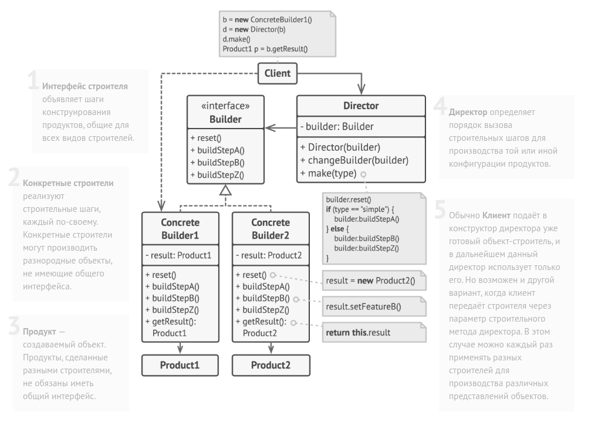
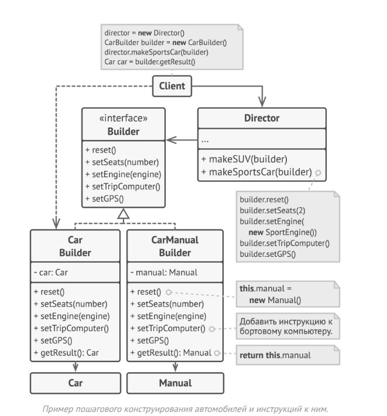
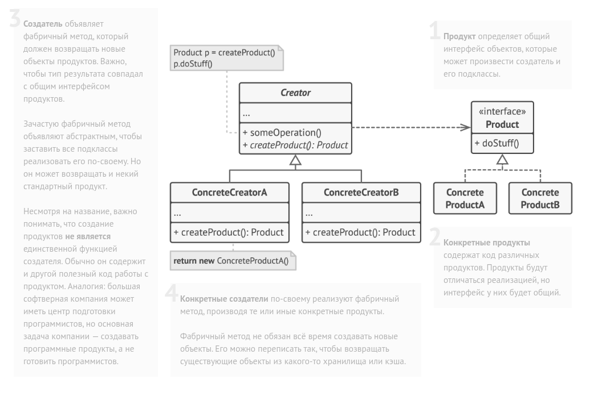

## Паттерны проектирования на примере python

1) **Строитель — это порождающий паттерн проектирования, 
который позволяет создавать объекты поэтапно.**
    
В отличие от других порождающих паттернов, Строитель позволяет производить 
различные объекты, используя один и тот же процесс строительства.

Строитель представляет api для поэтапного конструирования сложного объекта
Суть в том что создание большого объекта мы определяем не в конструкторе, 
а в строителях.

*Применимость*: Паттерн можно часто встретить в Python-коде, особенно там, 
где требуется пошаговое создание объектов или конфигурация (комбинаций) 
сложных объектов.

*Признаки применения паттерна*: Строителя можно узнать в классе, который имеет 
один создающий метод и несколько методов настройки создаваемого продукта. 
Обычно, методы настройки вызывают для удобства цепочкой 
(например, someBuilder.setValueA(1).setValueB(2).create()).

*Когда применять*:
- Объект имеет много параметров, особенно опциональных. Традиционный 
подход (огромный конструктор) может быть громоздким и неуправляемым.
- Нужно создавать разные комбинации объекта с разными параметрами. 
Например, деревянные и железобетонные дома. 
- Нужно собирать сложные составные объекты — строитель конструирует 
объекты пошагово, а не за один проход.
- Параметры могут быть опциональными или изменяться в зависимости от 
контекста. Например, в системах конфигурации (настройка серверов или баз данных) 
использование билдера позволяет чётко определить, какие параметры обязательны, 
а какие могут быть добавлены по мере необходимости. 
- Нужно строить сложные документы — отчёты или контракты, где структура документа 
может варьироваться в зависимости от типа содержимого. Используя билдера, разработчики 
могут создавать документ поэтапно, добавляя различные секции и элементы. 

**Не стоит использовать Builder везде подряд — если объект простой и имеет 
всего несколько обязательных параметров, то обычный конструктор будет достаточен.**

2) **Фабричный метод — это порождающий паттерн проектирования, 
который определяет общий интерфейс для создания объектов в 
суперклассе, позволяя подклассам изменять тип создаваемых объектов.**

Если в крадце, то это альтернатива конструкторам,
имеющие преимущество в найменге.

Фабричный метод — это порождающий паттерн проектирования, который решает 
проблему создания различных продуктов, без указания конкретных классов 
продуктов.

Фабричный метод задаёт метод, который следует использовать вместо вызова 
оператора new для создания объектов-продуктов. Подклассы могут переопределить 
этот метод, чтобы изменять тип создаваемых продуктов.

*Применимость*: Паттерн можно часто встретить в любом Python-коде, где 
требуется гибкость при создании продуктов.

*Признаки применения паттерна*: Фабричный метод можно определить по 
создающим методам, которые возвращают объекты продуктов через абстрактные 
типы или интерфейсы. Это позволяет переопределять типы создаваемых 
продуктов в подклассах.

Таким образом в коде мы работаем с абстракцией, а не с конкретными объектами.
