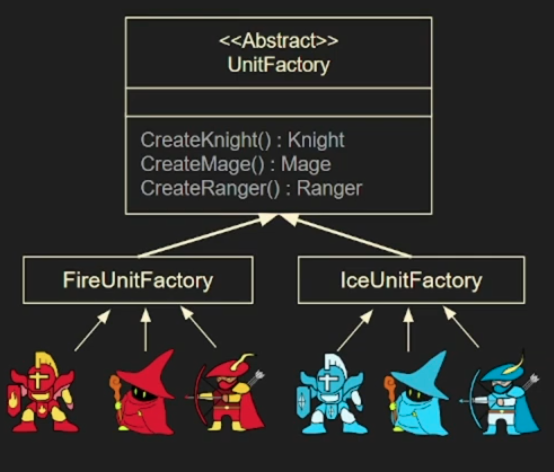
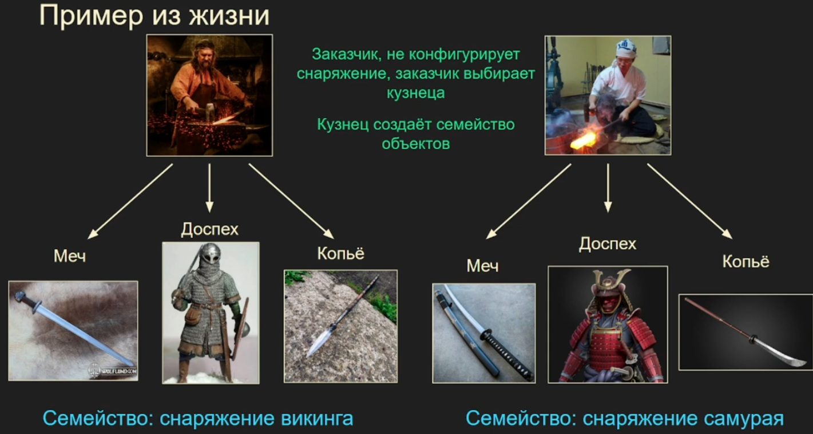
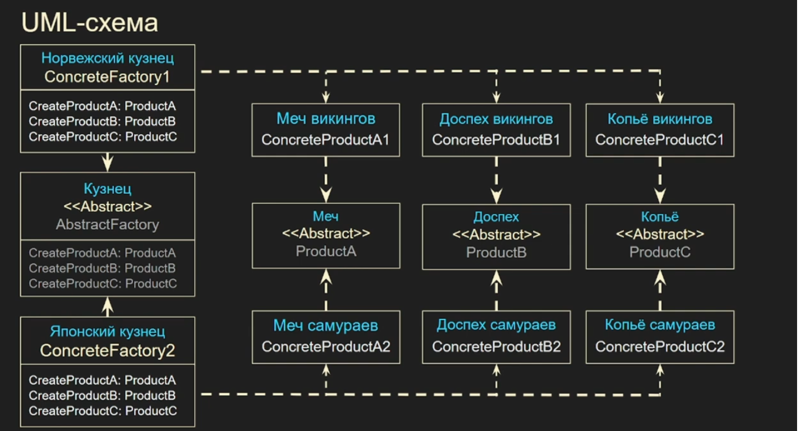
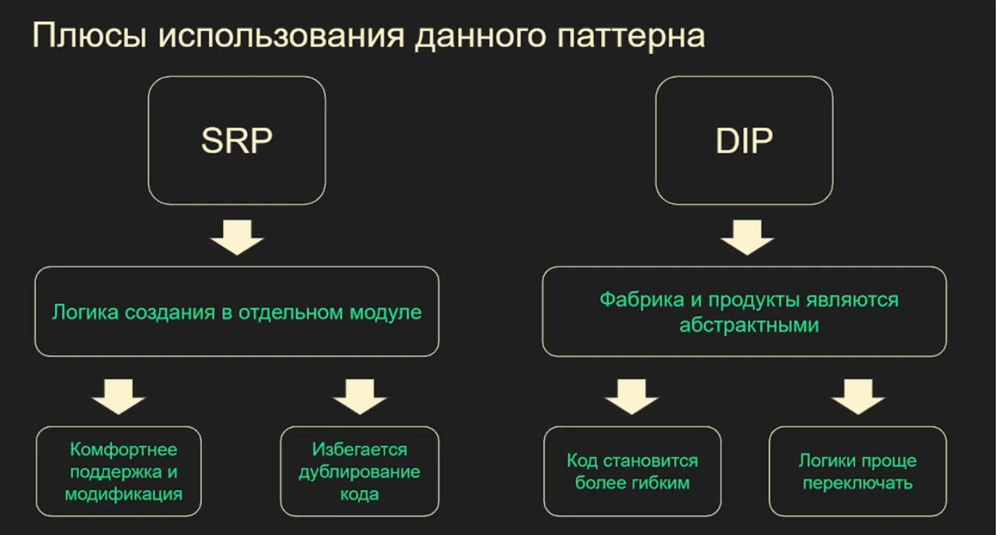
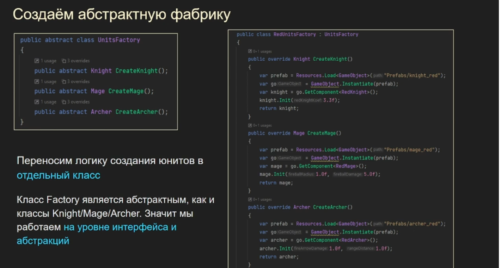
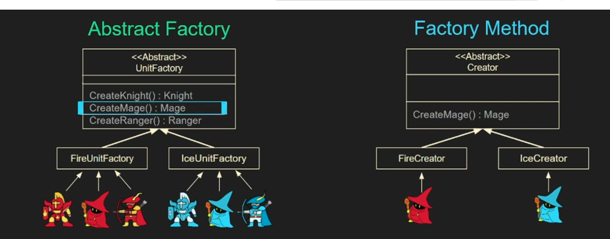

## Абстрактная фабрика

\- это порождающий паттерн, который предоставляет интерфейс для создания семейств
взаимосвязанных объектов, не привязываясь к конкретным класса создаваемых объектов.

Ключевые моменты:
- уносим логику создания объектов в отдельный класс (во всех порожд. патт.)
- предназначен для создания семейств объектов
- и с фабриками и с продуктами мы работаем на уровне интерфейса

Когда пользоваться?
- Когда система не должна зависеть от способа создания и компоновки новых объектов
- Когда создаваемые объекты должны использоваться вместе и являются взаимосвязанными

Сущности: 
- abstract factory (абстрактная фабрика) она определяет общий интерфейс для создания семейства
продуктов
- abstract product (абстрактный продукт) он определяет общий интерфейс для продуктов, которые
связаны друг с другом по смыслу
- concrete factory (конкретная фабрика) она рализует общий интерфейс и создает свою
вариацию семейства продуктов
- concrete product (конкретный продукт) конкретный продукт со своей вариацией

В чем разница между фабричным методом?
1) абстр. фабрика предназначена для семейств объектов
2) фабричный метод предназначен для создания ед. объекта с неявной реализацией