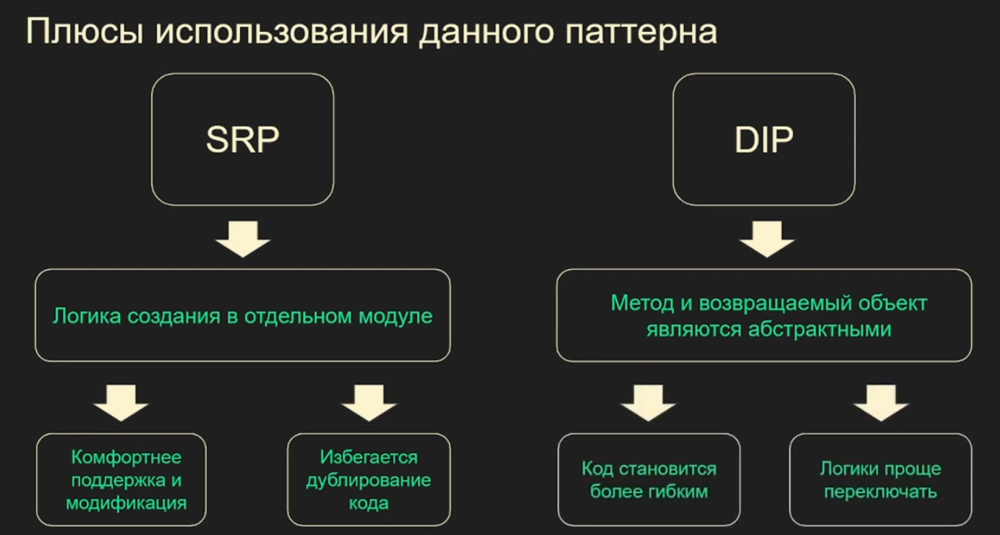
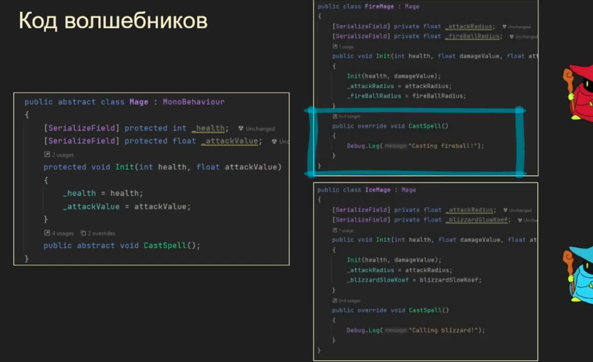
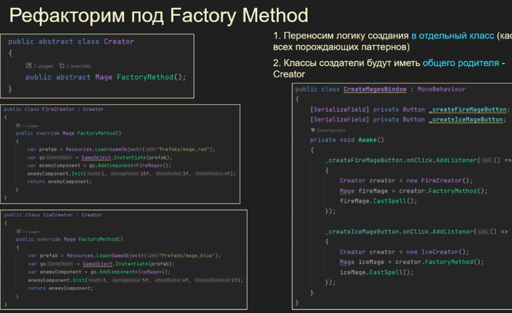

## Фабричный метод
\- это порождающий паттерн, который определяет интерфейс для создания объектов
в дочерних классах, при этом дочерние классы уже сами решают объекты какого класса нужно
создавать. То есть он инкапсулирует (делегирует) логику создания
объектов в дочерние классы, 

Когда пользоваться?
Когда необходимо создавать единичный объект, конкретная реализация которого неоднозначна.

*\* Фабричный метод может являться составной частью абстрактного фабричного метода и наоборот.
Абстрактная фабрика состоит из множества фабричных методов*

Сущности: 
- abstract creator (абстрактный создатель) определяет интерфейс, базовый фабричный метод,
который возвращает новый объект продукта.
- concrete creator (конкретный создатель) реализует интерфейс абстр. создателя и фабричный метод
по своему, но при этом результатом его работы будет продукт. Фабричный метод не обязан всё 
время создавать новые объекты. Его можно переписать так, чтобы возвращать существующие 
объекты из какого-то хранилища или кэша.
- abstract product (абстрактный продукт) определяет общий интерфейс объектов, которые создатели
могут произвести.
- concrete product (конкретный продукт) реализует базовый интерфейс, в нем происходит реализация
конкретного продукта, которые будут создавать создатели. Реализация может быть разной, но интерфейс один.

